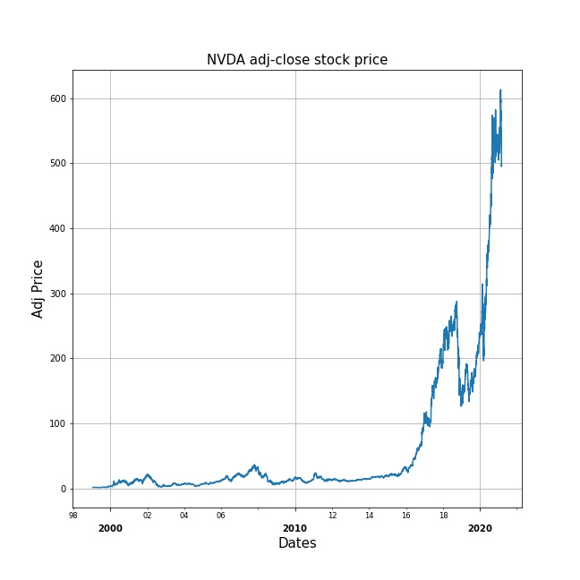
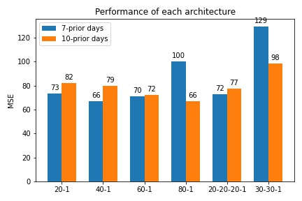
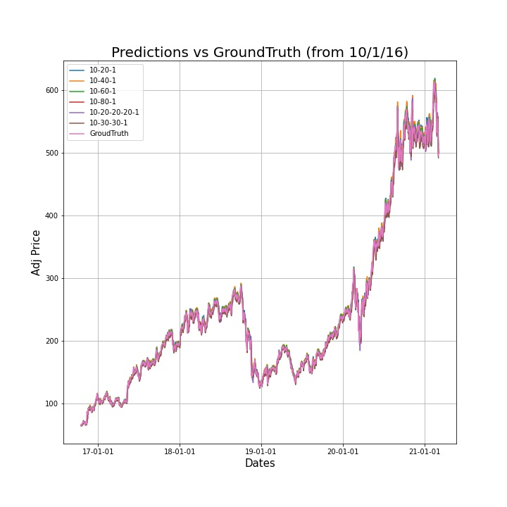

## Design an ANN model for predicting the NVDA stock price from 1999-2021

This work focused on designing an ANN model to predict NVDA stock price. 
For the dataset, I downloaded the csv file from https://finance.yahoo.com/quote/NVDA/history/. To make this mini-project simple, I only used 'Adj Close Price' as my datapoints. Here is the visualization of the dataset I used. This work splited the dataset into 60:20:20 for train:val:test, and used the n-prior days technique to deal with time-series regression problems.

### MSE performance of using different ANN architectures 

  
### MSE prediction performance of using different ANN architectures 

  
here I just list 10-prior days' performances. For more info, feel free to check on my ipynb file
