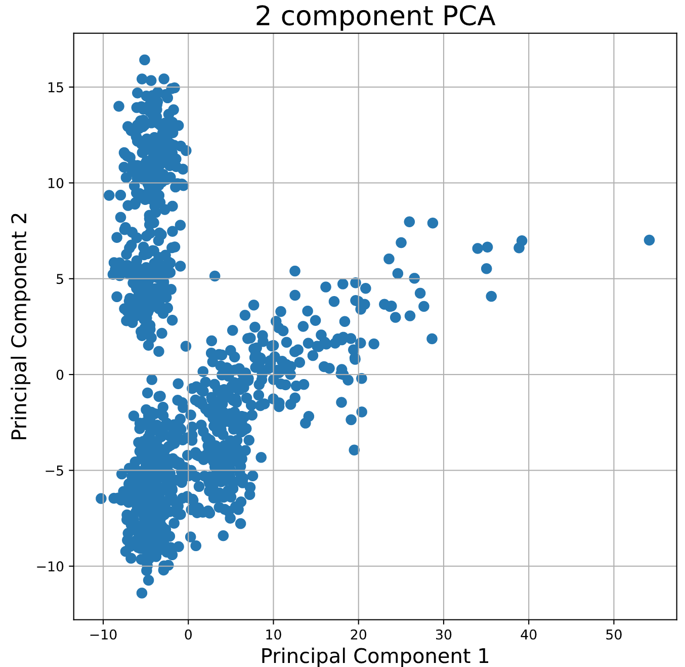
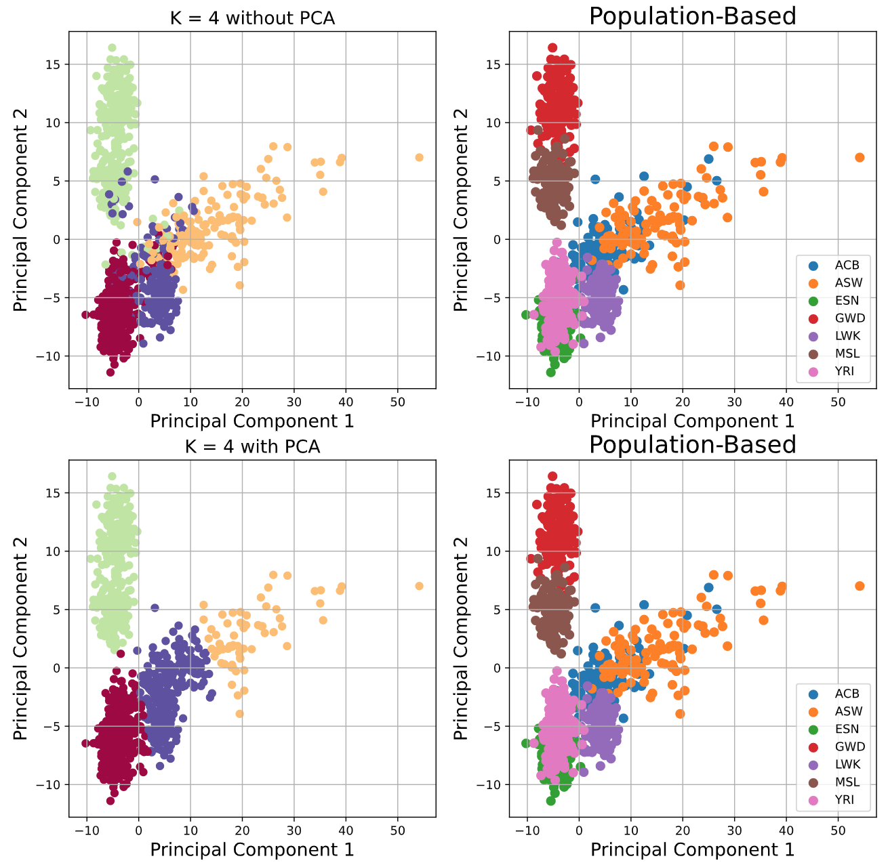
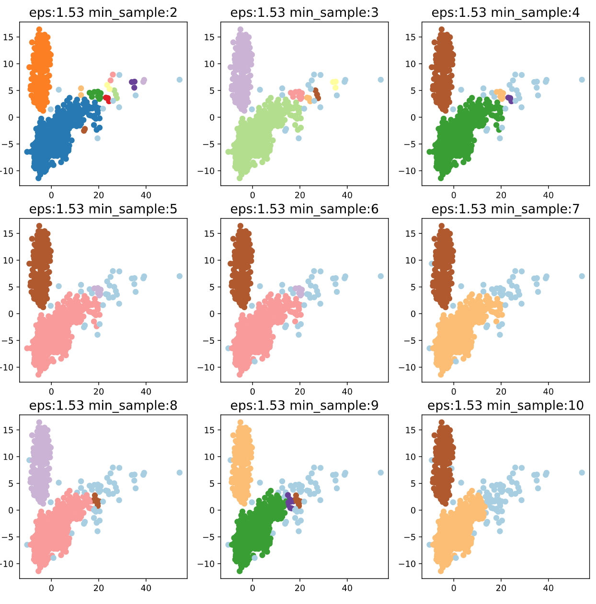
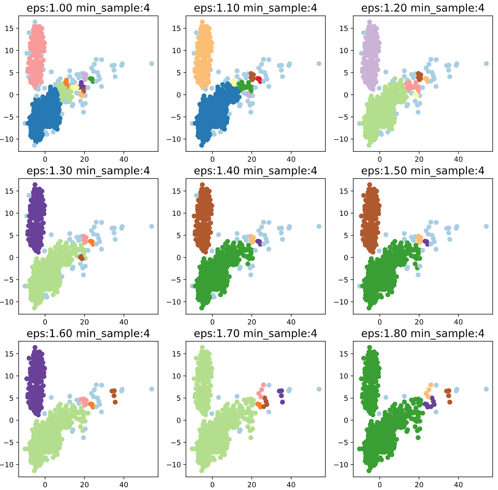

## Applying Meachine Learning Models to Genome Dataset

This work focused on applying DBSCAN and KMEAN++ models to perform unsupervised learning for genome analysis. 
The size of the original dataset is (995 rows × 10104 columns). 
Here I utilized the first and second principal component for unsupervised learning. Codes are explained in ipynb file, please feel free to check it out.

### Using First vs Second Principal Component Graph for Unsupervised Learning

### Using KMEANS++ Model to Perform Unsupervised Learning
(here K = 4, distance is set by default with Euclidean Distance, and initial points were randomly generatered then selected with the best performance based on the SSE evaluation)

### Using DBSCAN Model to Perform Unsupervised Learning

For more details feel free to check the .ipynb file.
