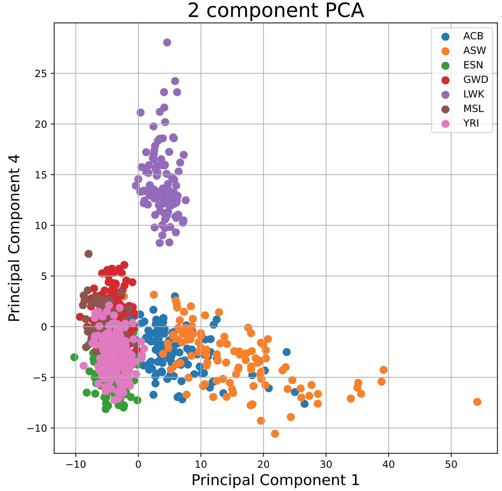
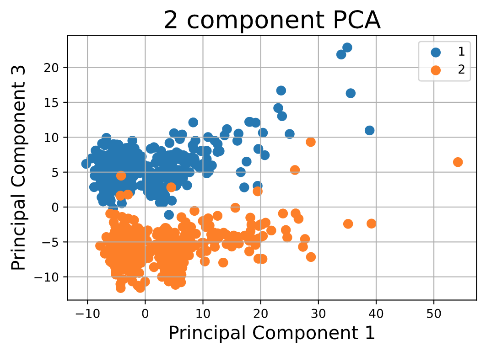

## Using PCA for Genome Analysis

This work focused on applying PCA to reduce dimensions for genome analysis. The size of the original dataset is (995 rows × 10104 columns). Here I explored with at most the first 4 principal components and geographic knowledge domain. Codes are explained in ipynb file, please feel free to check it out.

### Using Principal Component 1 and Principal Component 2 for Analysis
(distinguished by population)

### Using Principal Component 1 and Principal Component 3 for Analysis 
(distinguished by gender 1 = male / 2 = female)

### Using Principal Component 1 and Principal Component 4 for Analysis 
(distinguished by population)

For more details feel free to check the .ipynb file.
