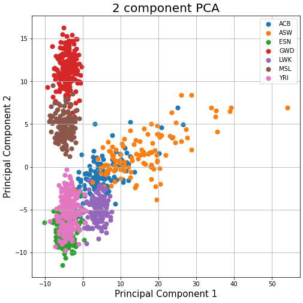

## Using PCA for Genome Analysis

This work focused on applying PCA to reduce dimensions for genome analysis. The original dataset is (995x10103). Here I explored with at most first 4 principal components and related knowledge domain. Codes are explained in ipynb file, please feel free to check it out.

### Using Principal Component 1 and Principal Component 2 for analysis

### Using Principal Component 1 and Principal Component 3 for analysis (distinguished by gender 1 = male / 2 = female)

### Using Principal Component 1 and Principal Component 4 for analysis (distinguished by population)

For more details feel free to check the .ipynb file.
