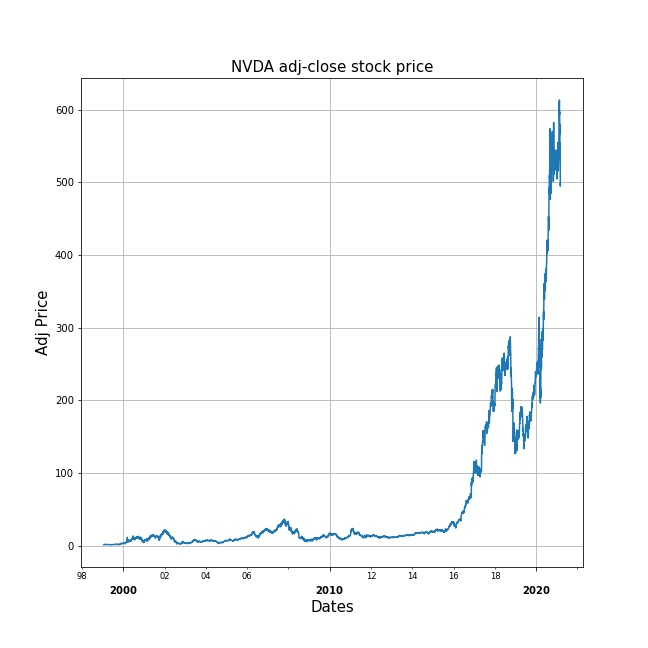
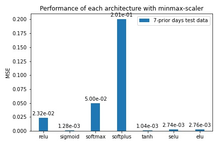
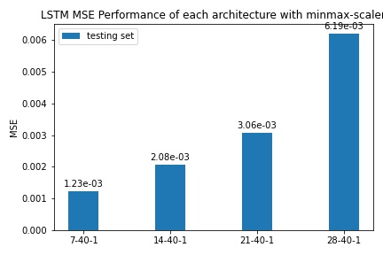
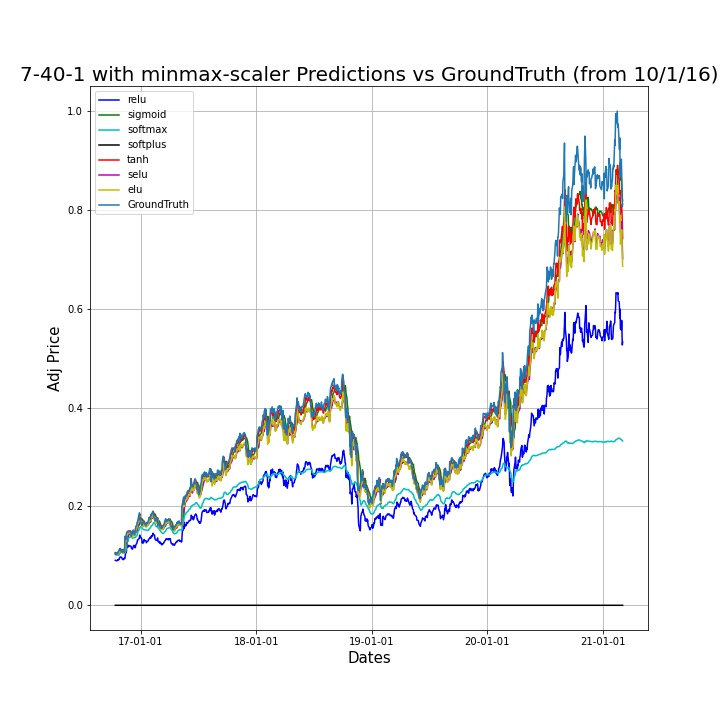
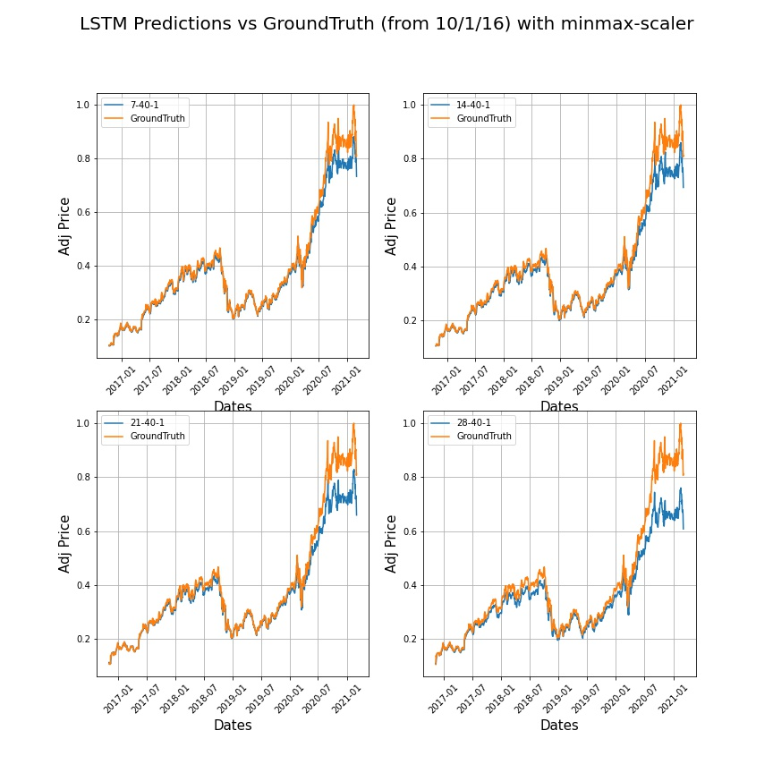

## Deploy a RNN-LSTM model for predicting the NVDA stock price from 1999-2021

This work focused on deploying a RNN-LSTM model for predicting the NVDA stock price from 1999-2021.
For the dataset, I downloaded the csv file from https://finance.yahoo.com/quote/NVDA/history/. To make this mini-project simple, I only used 'Adj Close Price' as my datapoints. Here is the visualization of the dataset I used. This work splited the dataset into 60:20:20 for train:val:test, and used the n-prior days technique to deal with time-series regression problems.

Here I used my 7-40-1 ANN model as an experiment, and explored different activation functions at hidden layers while setting activation function at output layer as relu.

## Data-Processing MinMax-Scaler are all applied in following results

### MSE performances of 7-40-1 ANN architectures on test dataset with different activation functions at the hidden layer

  
### MSE prediction performance of using RNN-LSTM architectures on test dataset 

### Prediction on test dataset using ANN architectures with different activation functions at hidden layer 

  
### Prediction on test dataset using RNN-LSTM architectures with different input layers
 

  
here I just list 10-prior days' performances. For more info, feel free to check on my ipynb file
